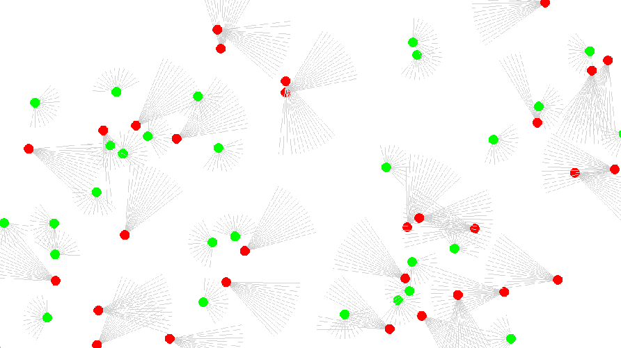

# Predator-Vs-Prey





## Description

This project implements a simulation of the evolution of predators and prey, using neural networks. The green circles represent prey, and the red circles represent predators. The black lines represent a cell's vision; preys have a short but wide view, while predators have a long but narrower field of vision. Cells can also move and turn at certain speeds, with predators having a somewhat higher maximum speed than preys. When a predator sees and touches a prey, the prey is eaten and disappears; predators who do not eat a prey in a certain amount of time will find themselves disappearing off the map themselves. If a prey survives for long enough, it will split into 2 preys; if a predator eats enough, it will split into 2 predators. Each cell is governed by a neural network that mutates randomly, and split cells will start with the same network as their parent. Both predators and prey become more adept at surviving the longer the simulation goes on, as cells with suboptimal neural networks die off.

## To Use

On Windows 11, using Powershell:

1. Check out the project:
```
git clone https://github.com/HDCat2/Predator-Vs-Prey.git
```
2. Install required dependencies:
```
pip install -r requirements.txt
```
3. Run the given batch file:
```
start run.bat
```

This project has not been made to work with any other OS. During the simulation, you can click on individual cells to print some debug information about them. Otherwise, enjoy watching!
